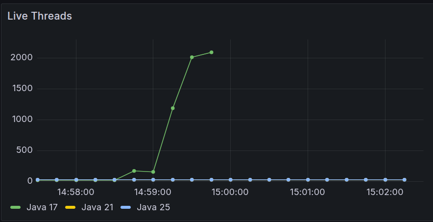
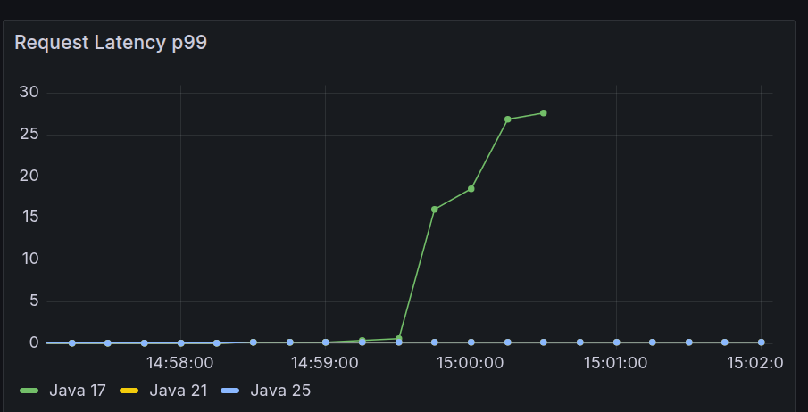
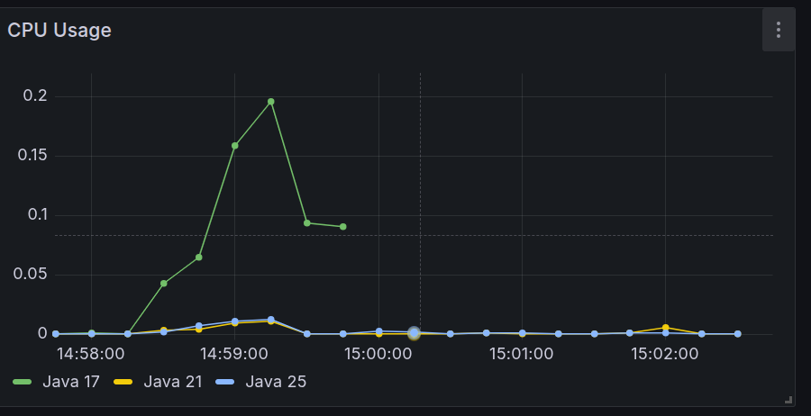

# Java Virtual Threads vs Platform Threads — Performance Benchmark


Benchmark comparing Java 17, 21, and 25 under high-concurrency I/O-bound workloads. Measures the real-world impact of Project Loom's virtual threads against traditional platform threads using a production-like observability stack.

## TL;DR

| | Java 17 | Java 21 | Java 25 |
|---|---|---|---|
| Thread model | Platform (OS threads) | Virtual threads | Virtual threads |
| Requests failed (200 VUs) | ~18–26% timeouts | 0% | 0% |
| Live threads under load | 2000+ (OS-level) | ~25 (JVM-managed) | ~25 (JVM-managed) |
| Behavior at saturation | Collapses | Stable | Stable |

## The Hypothesis

Platform threads are expensive — each one occupies ~1MB of stack and is backed by an OS thread. Under high concurrency, I/O-bound applications saturate the thread pool and start timing out.

Virtual threads (stable since Java 21) are JVM-managed and cost ~1KB each. When a virtual thread blocks on I/O, the JVM unmounts it from the carrier OS thread and runs another — enabling massive concurrency with minimal resource usage.

## Architecture

```
k6 (ramp-up: 10 → 200 VUs)
   │
   ├──→ java17:8081  (platform threads — Executors.newFixedThreadPool)
   ├──→ java21:8082  (virtual threads  — Executors.newVirtualThreadPerTaskExecutor)
   └──→ java25:8083  (virtual threads  — Executors.newVirtualThreadPerTaskExecutor)
              │
              └──→ Prometheus :9090 ──→ Grafana :3000
```

All three apps are identical Spring Boot applications — same endpoint, same logic, same dependencies. The only difference is the thread execution strategy.

## Workload

Each request to `/benchmark/concurrent?tasks=50&delay=100` spawns 50 concurrent tasks that each sleep 100ms (simulating blocking I/O — database queries, external HTTP calls, file reads). The endpoint waits for all tasks to complete via `CompletableFuture.allOf()`.

At 200 VUs this means up to **10,000 concurrent blocking tasks** per second — exactly the scenario where platform threads collapse and virtual threads shine.

## Results

**k6 Load Profile:** 30s warm-up → 2m ramp to 200 VUs → 3m plateau → 1m ramp-down

| Metric | Java 17 | Java 21 | Java 25 |
|---|---|---|---|
| Success rate | ~74–82% | 100% | 100% |
| p95 latency (plateau) | 60s (timeout) | ~120ms | ~120ms |
| p99 latency (plateau) | 60s (timeout) | ~120ms | ~120ms |
| Peak live threads | 2000+ | ~25 | ~25 |

> Java 17 exhausts its OS thread pool under 200 VUs, causing requests to queue and eventually timeout. Java 21/25 handle the same load effortlessly — virtual threads are parked while waiting for I/O, freeing carrier threads for other work.

### Live Threads

Java 17 spawned **2000+ OS threads** under peak load. Java 21 and 25 stayed flat near zero — the JVM multiplexes millions of virtual threads onto a small fixed pool of carrier threads.



### Request Latency p95

Java 17 latency climbed to **30s** at the plateau. Java 21 and 25 remained at ~100ms — indistinguishable from baseline.



### CPU Usage

Java 17 spiked to ~10% CPU just from thread context switching overhead — not from actual work. Virtual threads eliminated that cost entirely.



## Stack

| Component | Technology |
|---|---|
| Applications | Spring Boot 3.5.0 (Java 21/25), Spring Boot 3.2.x (Java 17) |
| Metrics | Micrometer + Prometheus |
| Dashboards | Grafana 11 (auto-provisioned) |
| Load testing | k6 |
| Containerization | Docker Compose |

## How to Run

**Prerequisites:** Docker, Docker Compose, k6 (optional — runs via Docker)

```bash
# Clone and start the full stack
git clone <repo-url>
cd java-performance-versions
docker compose up --build

# In a separate terminal, run the load test (~6m30s)
docker run --rm -i \
  --network java-performance-versions_benchmark-net \
  grafana/k6 run - < k6/ramp-up.js

# Open Grafana dashboard
xdg-open http://localhost:3000  # login: admin / admin
```

## Grafana Dashboard

Pre-provisioned with 6 panels — no manual setup needed:

- **Request Latency p95 / p99** — primary comparison metric
- **Throughput (req/s)** — requests served per second
- **Live Threads** — most visible difference between thread models
- **Heap Memory** — GC pressure over time
- **CPU Usage** — efficiency under sustained load

## Key Observations

1. **Live Threads** is the most striking panel — Java 17 peaked at **2000+ OS threads** while Java 21/25 stayed at ~25. That's a **40x difference** in thread count for the same workload. Virtual threads don't appear as OS threads; the JVM multiplexes them onto a small fixed pool of carrier threads.

2. **Latency p95** stays flat for virtual threads regardless of VU count. For Java 17 it climbs steeply as threads queue up waiting for pool availability.

3. **Failure rate** on Java 17 is caused by k6's 60s timeout — the app is alive but threads are stuck waiting. This is the classic thread starvation scenario in high-concurrency APIs backed by blocking I/O.

## Notes

- The workload is intentionally I/O-bound (sleep-based) to isolate thread scheduling behavior — for CPU-bound workloads, virtual threads provide no advantage
- Docker resource limits are not set; results reflect relative JVM behavior, not absolute production capacity
- k6 client-side metrics (VU counts, error rates) are terminal-only and not in Grafana
